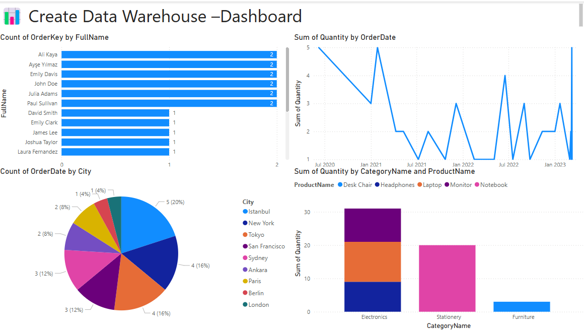

# 🏭 Create Data Warehouse — ETL + Power BI Project

An end-to-end data engineering project that extracts raw sales data through a Python ETL pipeline, loads it into a dimensional data warehouse (Kimball star schema), validates it with automated tests, and visualizes it with a Power BI dashboard.

---

## 📸 Dashboard Preview



---

## 🛠️ Technologies Used

| Tool | Purpose |
|------|---------|
| Python 3.x | ETL pipeline, data transformation |
| Pandas | Data cleaning and manipulation |
| SQLite | Data warehouse (portable, no install needed) |
| SQL | Schema creation, OLAP-style queries |
| Power BI | Interactive dashboard and reporting |
| Kimball Model | Dimensional data modeling (star schema) |

---

## 📁 Project Structure

```
ETL-PowerBI-DataWarehouse-Project/
│
├── seed_data/                   # Source CSV datasets
│   ├── customers.csv            # 20 customer records
│   ├── products.csv             # 20 product records
│   └── orders.csv               # 20 order transactions
│
├── assets/
│   └── dashboard_preview.png    # Power BI dashboard screenshot
│
├── etl_pipeline.py              # Main ETL script (Extract → Transform → Load)
├── procedures.py                # Analytical query functions
├── test_pipeline.py             # Automated test suite (19 tests)
├── schema.sql                   # Data warehouse DDL (SQLite + MSSQL)
├── analysis_queries.sql         # OLAP-style SQL queries for Power BI
├── requirements.txt             # Python dependencies
├── etl_errors.log               # Data quality issues (auto-generated)
├── .gitignore
└── README.md
```

---

## 🧮 Data Warehouse Model (Kimball Star Schema)

```
                    ┌─────────────┐
                    │  DimDate    │
                    │─────────────│
                    │ DateKey PK  │
                    │ FullDate    │
                    │ Year        │
                    │ Month       │
                    │ Quarter     │
                    │ MonthName   │
                    └──────┬──────┘
                           │
┌──────────────┐    ┌──────┴──────┐    ┌──────────────┐
│ DimCustomer  │    │  FactOrder  │    │  DimProduct  │
│──────────────│    │─────────────│    │──────────────│
│CustomerKey PK├────┤CustomerKey  ├────┤ProductKey PK │
│ FullName     │    │ProductKey   │    │ ProductName  │
│ Email        │    │DateKey      │    │ Price        │
│ City         │    │Quantity     │    │ Stock        │
│ SignupDate   │    │TotalAmount  │    │ CategoryKey──┼──┐
└──────────────┘    │PaymentType  │    └──────────────┘  │
                    │Status       │                       │
                    └─────────────┘              ┌────────┴────┐
                                                 │ DimCategory │
                                                 │─────────────│
                                                 │CategoryKey  │
                                                 │CategoryName │
                                                 └─────────────┘
```

| Fact Table | Dimension Tables |
|------------|-----------------|
| FactOrder  | DimCustomer, DimProduct, DimCategory, DimDate |

---

## ⚙️ ETL Workflow

```
[CSV Files] → EXTRACT → TRANSFORM → LOAD → [SQLite DW] → [Power BI]
```

**Extract** — Reads `customers.csv`, `products.csv`, `orders.csv` from `seed_data/`

**Transform** — Cleans data, handles nulls, validates formats, builds dimension keys, calculates `TotalAmount = Price × Quantity`, enriches DimDate with Month/Quarter/DayOfWeek

**Load** — Creates star schema tables in SQLite, inserts dimension records first (maintaining referential integrity), then loads FactOrder

**Validate** — `test_pipeline.py` runs 19 automated checks across connection, row counts, referential integrity, data quality, and business logic

---

## 📊 Key Insights (from the Dashboard)

- **Top City by Orders**: Tokyo — 4 orders
- **Most Used Payment**: Debit Card — 9 orders (45%)
- **Top Category by Revenue**: Furniture — $13,050
- **Top Customer**: Paul Sullivan / Julia Adams / Emily Davis — 2 orders each
- **Data Warehouse**: 5 tables, 83 total records loaded

---

## ▶️ How to Run

**1. Clone the repository**
```bash
git clone https://github.com/Alianwar09/ETL-PowerBI-DataWarehouse-Project.git
cd ETL-PowerBI-DataWarehouse-Project
```

**2. Install dependencies**
```bash
pip install -r requirements.txt
```

**3. Run the ETL pipeline**
```bash
python etl_pipeline.py
```
This generates `data_warehouse.db` and `etl_errors.log`.

**4. Run the test suite**
```bash
python test_pipeline.py
```
Expected: ✅ 19/19 tests passed

**5. Run analytical queries**
```bash
python procedures.py
```

**6. Connect Power BI**
- Open Power BI Desktop
- Click **Get Data → More → Database → SQLite**  
  *(or use ODBC if SQLite connector is unavailable)*
- Select `data_warehouse.db`
- Import the tables and build your visuals using `analysis_queries.sql` as reference

---

## 📈 Dashboard Visuals

| Visual | Description |
|--------|------------|
| Bar Chart | Top customers by order count |
| Pie Chart | Order distribution by city |
| Line Chart | Monthly order trend over time |
| Stacked Column | Sales quantity by product category |

---

## 🗄️ Connecting to MSSQL Server (Optional)

The project defaults to SQLite for portability. To use Microsoft SQL Server instead:

1. Create a `.env` file in the root:
```env
DB_SERVER=your_server_name
DB_NAME=your_database_name
DB_AUTH=windows
```

2. Run the MSSQL schema from `schema.sql` (see MSSQL section in comments)

3. Install additional dependencies:
```bash
pip install pyodbc python-dotenv
```

---

## 👤 Author

**Ali Anwar**  
BCA Student — School of Management Sciences, Lucknow  
Roll No: 2310924050009

---

## 📄 License

Open for academic reference. Feel free to fork and build upon it.
